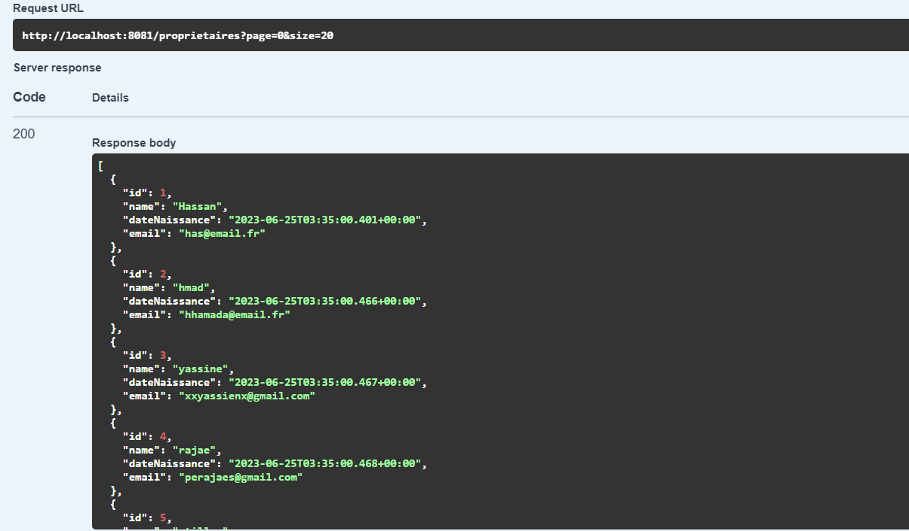

# Radar Violations Detection System

## Introduction

This project is a radar violations detection system based on microservices architecture it build using spring boot, Angular and docker.  
the complete system divided into 3 microservices, an eureka server and a cloud gatewayn in addition to a simple radar simulator that generate infraction automaticlly then the front end with angular.  
The first microservice is the [immatriculation service](/immatriculation-service) which is responsible for the vehciules data and their owners.  
The second microservice is the [infraction service](/infraction-service/) which is responsible for the violations data.
The third microservice is the [radar service](/radar-service) which is responsible for the radar data and it communicates with the other two microservices to get informations needed to generate the violations.  
The [eureka server](/eureka-discovery) is responsible for the service discovery and the [cloud gateway](/gateway-service) is responsible for the routing and the load balancing.  
The [radar simulator](/radar-simulation/) is a simple application that generate infraction automaticlly and send them to the radar service.

## Table of contents

- [Introduction](#introduction)
- [Table of contents](#table-of-contents)
- [Getting Started](#getting-started)
  - [Prerequisites](#prerequisites)
- [Technologie used](#technologie-used)
- [Technical Architecture](#technical-architecture)
- [Class diagram](#class-diagram)
- [Backend Services](#backend-services)
  - [Eureka Server](#eureka-server)
  - [Cloud Gateway](#cloud-gateway)
  - [Immatriculation Service](#immatriculation-service)
  - [Infraction Service](#infraction-service)
  - [Radar Service](#radar-service)
  - [Radar Simulator](#radar-simulation)
- [Frontend Service](#frontend)
- [Deployment](#deployment)
  - [Docker](#docker)
  


## Getting Started

### Prerequisites

Before running this application, you need to have the following software installed on your system :

- [Java 17](https://www.oracle.com/java/technologies/downloads/#java17)
- [Node.js 18](https://nodejs.org/en/download/)
- [Angular 16](https://angular.io/cli)
- [Docker](https://docs.docker.com/get-docker/)

## Technologie used

- Spring Boot
- Spring Cloud
- Eureka Discovery
- Angular
- Docker

## Technical Architecture  


## Class diagram


## Backend Services

```text
In the next section I will show the structure of each microservice in the order of their execution.
```

### Eureka Server

```text
Is a service discovery server, it is responsible for the registration of all microservices and the gateway.
```

- Service Structure

```inlinetext
├───src
│   ├───main
│   │   ├───java
│   │   │   └───me
│   │   │       └───project
│   │   │           └───eurekadiscovery
│   │   └───resources
│   └───test
│       └───java
│           └───me
│               └───project
│                   └───eurekadiscovery
└───target

```

$$ Eureka discovery $$


### Cloud Gateway

```text
Is a service that acts as a gateway to all microservices, it is responsible for routing and load balancing.
```

- Service Structure

```inlinetext
├───src
│   ├───main
│   │   ├───java
│   │   │   └───com
│   │   │       └───example
│   │   │           └───gatewayservice
│   │   │               └───security
│   │   └───resources
│   └───test
│       └───java
│           └───com
│               └───example
│                   └───gatewayservice
└───target
```

### Immatriculation Service

```text
Is a service that manage the vehicules and their owners.
An owner is defined by their ID, name, date of birth, email.
A vehicle is defined by its ID, regestration number, brand, fiscal power, and model
and it can be accessed by different connectors (REST, SOAP, GraphQL, gRPC).
```

- Service Structure

```inlinetext
├───src
│   ├───main
│   │   ├───java
│   │   │   └───me
│   │   │       └───project
│   │   │           └───immatriculationservice
│   │   │               ├───config
│   │   │               ├───dtos
│   │   │               ├───entities
│   │   │               ├───repositories
│   │   │               ├───services
│   │   │               ├───stubs
│   │   │               └───web
│   │   │                   ├───graphql
│   │   │                   ├───grpc
│   │   │                   ├───rest
│   │   │                   └───soap
│   │   └───resources
│   │       ├───graphql
│   │       ├───static
│   │       └───templates
│   └───test
│       └───java
│           ├───com
│           │   └───example
│           └───me
│               └───project
│                   └───immatriculationservice
└───target
```

- Testing web services
$$ REST (swagger-ui)$$

> Available methods :  


> Get all vehicules :


> Get all owners :



> Get all radars:


$$ SOAP (SOAP UI) $$


> available methods :


> Get all vehicules :


> Get all owners :


$$ GraphQL (GraphiQL) $$

> Get all vehicules :


> Get all owners :


> Add vehicule :


$$ gRPC (BloomRPC) $$

> Get all vehicules :


> Get all owners :


### Infraction Service

```text
Is a service that manage the infractions. an infraction defined by its Id, date, the radar number that detected violation, the vehicle matricule, the vehicle's speed, the radar's maximum speed limit, and the fine amount . it can be accessed only by REST connector.
```

- Service Structure

```inlinetext
├───src
│   ├───main
│   │   ├───java
│   │   │   └───me
│   │   │       └───project
│   │   │           └───infractionservice
│   │   │               ├───entities
│   │   │               ├───repositories
│   │   │               ├───services
│   │   │               └───web
│   │   └───resources
│   │       ├───static
│   │       └───templates
│   └───test
│       └───java
│           └───me
│               └───project
│                   └───infractionservice
└───target
```

- Testing web service

$$ REST (swagger-ui)$$

> Available methods :


> Get all infractions :


### Radar Service

```text
Is a sevice thet manage radars and it can generate infractions for vehicles that exceed the speed limit. and it can access to other services using feign client.
a radar is defined by its ID, maximum speed limit, and coordinates (longitude and latitude), it can accessed by rest connector but the radar simulation is done by gRPC connector.
```

- Service Structure

```inlinetext
├───src
│   ├───main
│   │   ├───java
│   │   │   └───me
│   │   │       └───project
│   │   │           └───radarservice
│   │   │               ├───clients
│   │   │               ├───config
│   │   │               ├───dtos
│   │   │               ├───entities
│   │   │               ├───model
│   │   │               ├───repositories
│   │   │               ├───services
│   │   │               └───web
│   │   │                   └───grpc
│   │   │                       └───stubs
│   │   └───resources
│   │       ├───static
│   │       └───templates
│   └───test
│       └───java
│           └───me
│               └───project
│                   └───radarservice
└───target
```

- Testing web service

$$ REST (swagger-ui)$$

> Available methods :


> Get all radars :


> Generate Infraction:


$$ gRPC (bloomrpc) $$

> Generate Infraction:


### Radar Simulation

```text
this is a simple java application that simulate the radars by generating random speed for each radar and send it to the radar service using gRPC connector.
```

- Application Structure

```inlinetext
├───src
│   ├───main
│   │   ├───java
│   │   │   └───me
│   │   │       └───grpc
│   │   │           └───stubs
│   │   └───resources
│   └───test
│       └───java
└───target
```

- Testing application


## Frontend

```text
its a simple web application that consume the web services using REST connector. and it allows to explore the vehicules and their owners, the infractions and the radars.
and it allows adding, updating and deleting radars.
```

- Application Structure


- Testing application

>Login page:


>Welcome page:


>Explore vehicules:


when clicking on the owner icon it will show the owner details.


>Explore infractions:


>Explore radars:


>Add radar:


>Update radar:


## Deployment

### Docker

```text
this is a simple docker-compose file that allow to run all the services and the frontend application.
```

- first step you need to create for each service a docker file that contains the following instructions:

```dockerfile
# Use the official maven/Java 17 image to create a build artifact.
FROM maven:3.8.1-openjdk-17 as builder

# Set the working directory in the image to /app
WORKDIR /app

# Copy the pom.xml file into the image
COPY ./pom.xml ./pom.xml

# Download all required dependencies into one layer
RUN mvn dependency:go-offline -B

# Copy your other files
COPY ./src ./src

# Build the project
RUN mvn clean package

# Use OpenJDK JRE for final image
FROM openjdk:17-jdk-alpine

# Set the working directory in the image to /app
WORKDIR /app

# Copy the jar file from builder image
COPY --from=builder /app/target/*.jar ./service.jar

# Run the application
CMD ["java", "-jar", "./service.jar"]
```

- second step you need to create a docker-compose file that contains the following instructions:

```dockerfile
version: '3'
services:
  eureka-discovery:
    container_name: eureka-discovery
    build: ./eureka-discovery
    ports:
      - 8761:8761
  gateway-service:
    container_name: gateway-service
    build: ./gateway-service
    ports:
      - 8888:8888
    depends_on:
      - eureka-discovery
  immatriculation-service:
    container_name: immatriculation-service
    build: ./immatriculation-service
    ports:
      - 8081:8081
      - 9090:9090
    depends_on:
      - eureka-discovery
  infraction-service:
    container_name: infraction-service
    build: ./infraction-service
    ports:
      - 8082:8082
    depends_on:
      - eureka-discovery
  radar-service:
    container_name: radar-service
    build: ./radar-service
    ports:
      - 8083:8083
      - 9091:9091
    depends_on:
      - eureka-discovery

```

- third step you need to run the following command to build the images and run the containers:

```bash
docker-compose up --build
```
